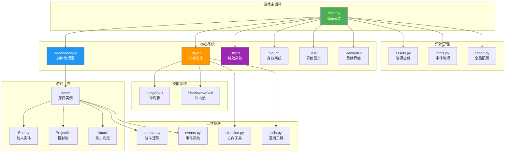
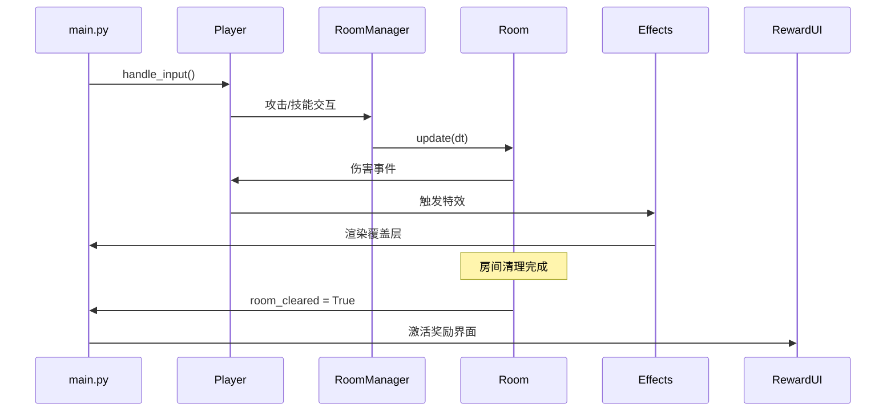

# 残响编年史 · Python 原型 - 项目结构图

## 📁 完整目录结构

```
never_up/
├── 📄 README.md                    # 项目说明文档
├── 📄 AGENTS.md                    # 开发规范和指南
├── 📄 requirements.txt             # Python依赖 (pygame>=2.5)
├── 📄 Makefile                      # 构建和开发命令
├── 📄 .gitignore                    # Git忽略文件
│
├── 📁 src/                          # 源代码目录
│   ├── 📄 __init__.py
│   ├── 📄 main.py                   # 🎮 游戏入口点
│   │
│   ├── 📁 game/                     # 核心游戏模块
│   │   ├── 📄 __init__.py
│   │   ├── 📄 config.py             # ⚙️ 全局配置常量
│   │   ├── 📄 entities.py           # 👥 实体系统 (玩家/敌人/投射物)
│   │   ├── 📄 rooms.py              # 🏠 房间管理与事件系统
│   │   ├── 📄 skills.py             # ⚔️ 技能系统 (冲刺斩/冲击波)
│   │   ├── 📄 combat.py             # ⚡ 战斗系统与攻击判定
│   │   ├── 📄 effects.py            # ✨ 视觉特效系统
│   │   ├── 📄 ui.py                 # 🖥️ 用户界面 (HUD/奖励界面)
│   │   ├── 📄 assets.py             # 🎨 资源加载与管理
│   │   ├── 📄 sound.py              # 🔊 音效系统 (可选)
│   │   ├── 📄 fonts.py              # 🔤 字体管理与中文字体支持
│   │   ├── 📄 direction.py          # 🧭 方向工具函数
│   │   └── 📄 utils.py              # 🛠️ 通用工具函数
│   │
│   └── 📁 datas/                    # 📦 备用资源目录
│       └── 🖼️ [200+ PNG图片]        # 游戏素材序列帧
│
├── 📁 assets/                       # 🎨 主要资源目录
│   ├── 📁 enemy/
│   │   ├── 📁 melee/                # 近战敌人精灵图
│   │   │   └── 🖼️ 1633-1.png ~ 1633-8.png
│   │   └── 📁 ranger/               # 远程敌人精灵图
│   │       └── 🖼️ 1295-1.png ~ 1295-10.png
│   │
│   ├── 📁 player/                   # 🎮 玩家精灵图
│   │   └── 🖼️ 1216-1.png ~ 1216-12.png
│   │
│   └── 📁 sfx/                      # 🔊 音效文件 (可选)
│       └── 📄 (预期: slash.wav, shockwave.wav, hit.wav, death.wav)
│
├── 📁 scripts/                      # 🛠️ 辅助脚本
│   └── 📄 select_assets.py          # 资源选择工具
│
└── 📁 docs/                         # 📚 文档目录
    ├── 📄 大纲1
    └── 📄 大纲2
```

## 🏗️ 系统架构图



## 🎮 核心模块详解

### 1. 游戏入口 (`src/main.py`)
- **Game类**: 主游戏循环，状态管理 (playing/reward/gameover)
- **初始化**: Pygame设置、资源预加载、字体系统
- **主循环**: 输入处理 → 更新 → 渲染 → 状态切换

### 2. 实体系统 (`src/game/entities.py`)
```python
Entity (基类)
├── Player (玩家)
│   ├── 移动/闪避/格挡
│   ├── 普攻连段系统
│   ├── 自动射击 (寻的子弹)
│   ├── 能量系统
│   └── 时间缩放能力
├── Enemy (敌人基类)
│   ├── AI行为
│   ├── 攻击前摇/后摇
│   └── 生命值管理
└── RangerEnemy (远程敌人)
    ├── 寻的射击
    └── 移动模式
```

### 3. 房间管理 (`src/game/rooms.py`)
```python
RoomManager
├── 房间生成与切换
├── 敌人生成管理
├── 投射物碰撞检测
└── GlobalEvents (全局事件分发)

Room
├── 敌人列表管理
├── 攻击判定更新
├── 房间清理检测
└── 奖励触发
```

### 4. 特效系统 (`src/game/effects.py`)
```python
Effects (管理器)
├── HitStop (命中停顿)
├── ScreenShake (屏幕震动)
├── FloatingText (飘字伤害)
├── ShockwaveRing (冲击波环)
├── Particle (粒子系统)
├── SlashArc (斩击拖尾)
├── QuickFlash (闪光效果)
└── Explosion (复合爆炸效果)
```

### 5. 技能系统 (`src/game/skills.py`)
```python
Skill (基类)
├── LungeSkill (Q键 - 冲刺斩)
│   ├── 突进位移
│   ├── 范围伤害
│   └── 穿透效果
└── ShockwaveSkill (E键 - 冲击波)
    ├── 范围击退
    ├── 伤害判定
    └── 特效触发
```

### 6. 战斗系统 (`src/game/combat.py`)
```python
Attack
├── 持续时间判定
├── 伤害快照
├── 位置/朝向更新
└── 可视化绘制
```

## 🔄 数据流与交互



## 🎯 游戏特性

### 核心机制
- **残响能量循环**: 命中/格挡/完美闪避获得能量
- **战斗系统**: 闪避/格挡/弹反 + 近战 + 自动寻的子弹
- **房间制Roguelike**: 清理房间 → 奖励选择 → 下一房间
- **技能变异**: 奖励选择强化技能

### 技术特点
- **时间缩放**: 子弹时间与命中停顿
- **事件驱动**: GlobalEvents系统处理伤害分发
- **资源回退**: assets/ → src/datas/ 的资源加载策略
- **无头模式**: 支持CI/自动化测试
- **中文支持**: 智能字体回退系统

## 🛠️ 开发工具

### Makefile 命令
```bash
make setup     # 安装依赖
make dev       # 运行游戏
make lint      # 代码检查
make test      # 运行测试 (待实现)
make build     # 打包发布
make assets    # 资源选择工具
```

### 环境变量
- `HEADLESS=1`: 无头模式运行
- `MAX_FRAMES=200`: 限制帧数 (用于测试)
- `CAPTURE_PATH=screenshot.png`: 截图保存
- `CAPTURE_FRAME=100`: 指定截图帧数

## 📊 代码统计

| 模块 | 文件数 | 主要功能 |
|------|--------|----------|
| 游戏核心 | 11个.py文件 | 完整的2D动作游戏框架 |
| 资源文件 | 200+ PNG | 精灵图序列帧 |
| 配置文件 | 1个 | 47行游戏参数配置 |
| 文档 | 3个 | 项目说明和开发规范 |

## 🎮 游戏循环流程

1. **输入处理** - 移动/攻击/格挡/闪避/技能
2. **游戏更新** - 房间、实体、特效系统
3. **战斗判定** - 近战持续判定、投射物碰撞
4. **状态切换** - 房间清理 → 奖励选择 → 下一房间
5. **渲染输出** - 世界渲染 + 特效覆盖层 + HUD

这个项目是一个结构清晰、功能完整的2D动作肉鸽游戏原型，采用了模块化设计和现代Python开发实践。